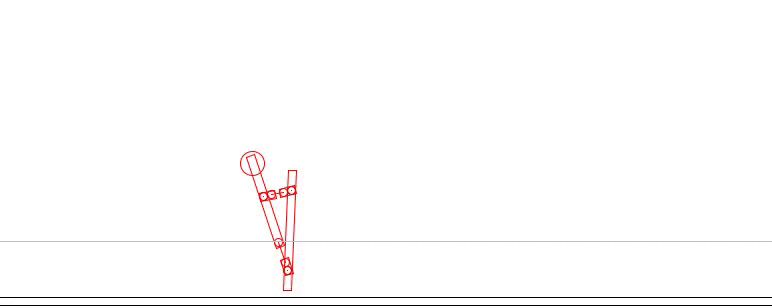
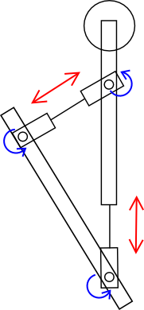

# HoppingGA

Learn how to play hopping (= pogo stick) by genetic algorithm.

## Model

## Genetic Algorithm

A gene is implemented as an integer array.
Its (2n)-th elements represent stretch speed of the model's arm,
and (2n+1)-th elements represent stretch speed of its leg.
Fitness is defined as how long the model stands and how far the model moves.

- gene length = 300
- crossover rate = 0.6
- selection = tournament
- mutation rate = 0.01
- population = 50
- elite = 1

